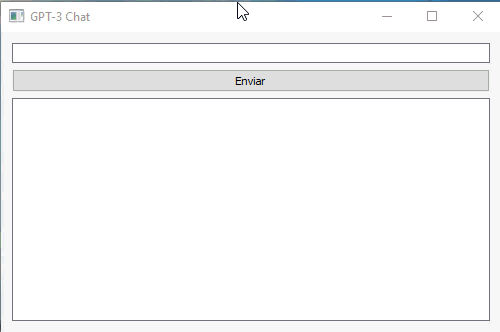

# gpt3-python-desktop
Chatbot de escritorio utilizando Python y GPT-3 de OpenAI.

Para esto lo primero que debes hacer es instalar las librerías necesarias: "pip install openai" y "pip install PyQt5".

Dentro de script de python chatbot.py debes insertar tu api key de openai.

